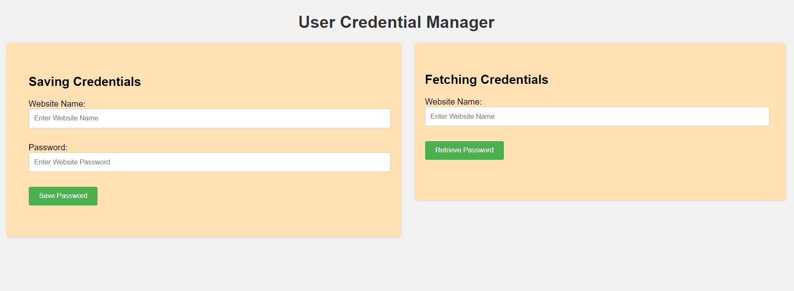
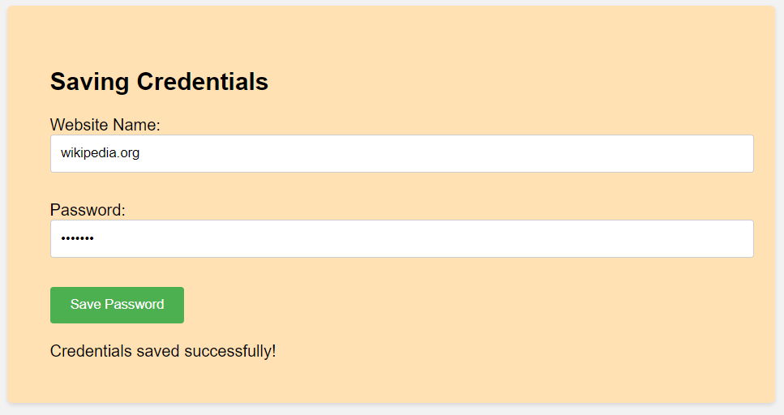
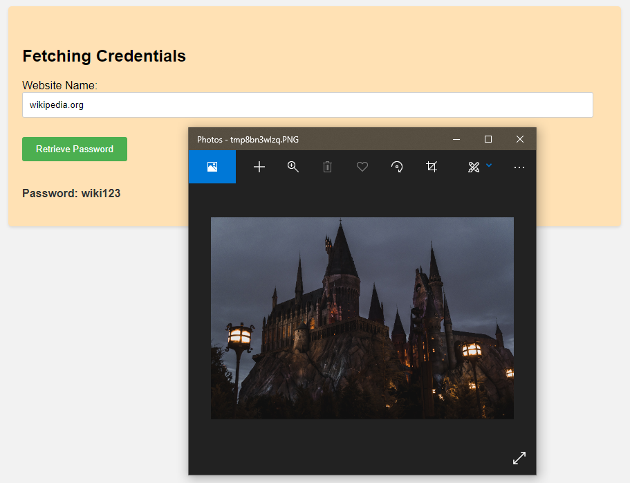
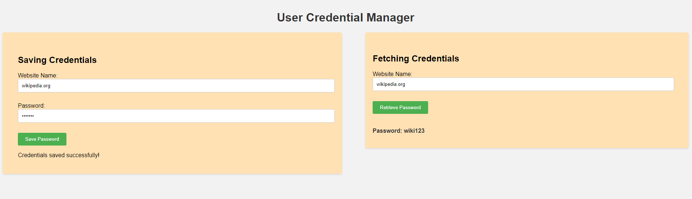
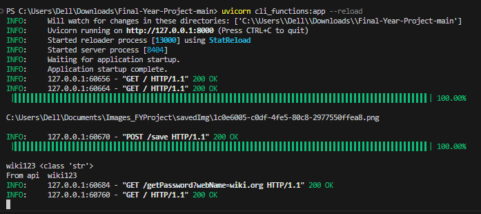

# Image steganography & blockchain-based Login Credentials stashing technique
Its a module to secure user credentials by using Image steganography & blockchain-based stashing technique. Developed by using Python,Javascript.
Here We have done a Basic website through which we are showing the stashing Operation.

## Available Features
### To Run: 
uvicorn cli_functions:app --reload

### Starting Normal Load Page

### Saving Credentials

### Fetching Credentials

### Full Page View

### Terminal View

